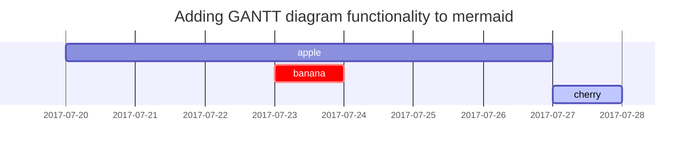

> DISCLAIMER
The information contained in this report/article/note is meant for the purposes of information only and is not intended to be investment, legal, tax or other advice, nor is it intended to be relied upon in making an investment or other decision. This report is provided with the understanding that the authors and publishers are not providing advice on legal, economic, investment or other professional issues and services. 
I am not responsible for the content of websites and information resources that may be referenced in the report. The access provided to these sites or the provision of such information resources does not constitute an endorsement by myself. of the information contained therein. However, unless expressly stated otherwise, the opinions, recommendations, findings, interpretations and conclusions expressed in this report represent the views of myself. 
The inclusion of company examples does not in any way constitute an endorsement of these organisations by myself or the signatories to the Principles for Responsible Investment. While I have endeavoured to ensure that the information contained in this report has been obtained from reliable and up-to-date sources, the changing nature of statistics, laws, rules and regulations may result in delays, omissions or inaccuracies in information contained in this report. I am not responsible for any errors or omissions, or for any decision made or action taken based on information contained in this report, or for any loss or damage arising from or caused by such decision or action. All information in this report is provided “as-is”, with no guarantee of completeness, accuracy, timeliness or of the results obtained from the use of this information, and without warranty of any kind, expressed or implied.
{: .prompt-tip }


### [Attribution](https://s-earnest.github.io/terms/#attribution "Permalink to Attribution")


https://s-earnest.github.io/


{:target="_blank"}


This post is to show Markdown syntax rendering on [**Chirpy**](https://github.com/cotes2020/jekyll-theme-chirpy/fork), you can also use it as an example of writing. Now, let's start looking at text and typography.

## Headings

# H1 - heading
{: .mt-4 .mb-0 }

## H2 - heading
{: data-toc-skip='' .mt-4 .mb-0 }

### H3 - heading
{: data-toc-skip='' .mt-4 .mb-0 }

#### H4 - heading
{: data-toc-skip='' .mt-4 }

## Paragraph

Quisque egestas convallis ipsum, ut sollicitudin risus tincidunt a. Maecenas interdum malesuada egestas. Duis consectetur porta risus, sit amet vulputate urna facilisis ac. Phasellus semper dui non purus ultrices sodales. Aliquam ante lorem, ornare a feugiat ac, finibus nec mauris. Vivamus ut tristique nisi. Sed vel leo vulputate, efficitur risus non, posuere mi. Nullam tincidunt bibendum rutrum. Proin commodo ornare sapien. Vivamus interdum diam sed sapien blandit, sit amet aliquam risus mattis. Nullam arcu turpis, mollis quis laoreet at, placerat id nibh. Suspendisse venenatis eros eros.

## Lists

### Ordered list

1. Firstly
2. Secondly
3. Thirdly

### Unordered list

- Chapter
  + Section
    * Paragraph

### ToDo list

- [ ] Job
  + [x] Step 1
  + [x] Step 2
  + [ ] Step 3

### Description list

Sun
: the star around which the earth orbits

Moon
: the natural satellite of the earth, visible by reflected light from the sun

## Block Quote

> This line shows the _block quote_.

## Prompts

> An example showing the `tip` type prompt.
{: .prompt-tip }

> An example showing the `info` type prompt.
{: .prompt-info }

> An example showing the `warning` type prompt.
{: .prompt-warning }

> An example showing the `danger` type prompt.
{: .prompt-danger }

## Tables

| Company                      | Contact          | Country |
|:-----------------------------|:-----------------|--------:|
| Alfreds Futterkiste          | Maria Anders     | Germany |
| Island Trading               | Helen Bennett    | UK      |
| Magazzini Alimentari Riuniti | Giovanni Rovelli | Italy   |

## Links

<http://127.0.0.1:4000>

## Footnote

Click the hook will locate the footnote[^footnote], and here is another footnote[^fn-nth-2].

## Inline code

This is an example of `Inline Code`.

## Filepath

Here is the `/path/to/the/file.extend`{: .filepath}.

## Code blocks

### Common

```
This is a common code snippet, without syntax highlight and line number.
```

### Specific Language

```bash
if [ $? -ne 0 ]; then
  echo "The command was not successful.";
  #do the needful / exit
fi;
```

### Specific filename

```sass
@import
  "colors/light-typography",
  "colors/dark-typography";
```
{: file='_sass/jekyll-theme-chirpy.scss'}

## Mathematics

The mathematics powered by [**MathJax**](https://www.mathjax.org/):

$$
\begin{equation}
  \sum_{n=1}^\infty 1/n^2 = \frac{\pi^2}{6}
  \label{eq:series}
\end{equation}
$$

We can reference the equation as \eqref{eq:series}.

When $a \ne 0$, there are two solutions to $ax^2 + bx + c = 0$ and they are

$$ x = {-b \pm \sqrt{b^2-4ac} \over 2a} $$

## Mermaid SVG



## Images

### Default (with caption)

{: width="972" height="589" }
_Full screen width and center alignment_

### Left aligned

{: width="972" height="589" .w-75 .normal}

### Float to left

{: width="972" height="589" .w-50 .left}
Praesent maximus aliquam sapien. Sed vel neque in dolor pulvinar auctor. Maecenas pharetra, sem sit amet interdum posuere, tellus lacus eleifend magna, ac lobortis felis ipsum id sapien. Proin ornare rutrum metus, ac convallis diam volutpat sit amet. Phasellus volutpat, elit sit amet tincidunt mollis, felis mi scelerisque mauris, ut facilisis leo magna accumsan sapien. In rutrum vehicula nisl eget tempor. Nullam maximus ullamcorper libero non maximus. Integer ultricies velit id convallis varius. Praesent eu nisl eu urna finibus ultrices id nec ex. Mauris ac mattis quam. Fusce aliquam est nec sapien bibendum, vitae malesuada ligula condimentum.

### Float to right

{: width="972" height="589" .w-50 .right}
Praesent maximus aliquam sapien. Sed vel neque in dolor pulvinar auctor. Maecenas pharetra, sem sit amet interdum posuere, tellus lacus eleifend magna, ac lobortis felis ipsum id sapien. Proin ornare rutrum metus, ac convallis diam volutpat sit amet. Phasellus volutpat, elit sit amet tincidunt mollis, felis mi scelerisque mauris, ut facilisis leo magna accumsan sapien. In rutrum vehicula nisl eget tempor. Nullam maximus ullamcorper libero non maximus. Integer ultricies velit id convallis varius. Praesent eu nisl eu urna finibus ultrices id nec ex. Mauris ac mattis quam. Fusce aliquam est nec sapien bibendum, vitae malesuada ligula condimentum.

### Dark/Light mode & Shadow

The image below will toggle dark/light mode based on theme preference, notice it has shadows.

{: .light .w-75 .shadow .rounded-10 w='1212' h='668' }
{: .dark .w-75 .shadow .rounded-10 w='1212' h='668' }

## Video



## Reverse Footnote

[^footnote]: The footnote source
[^fn-nth-2]: The 2nd footnote source
